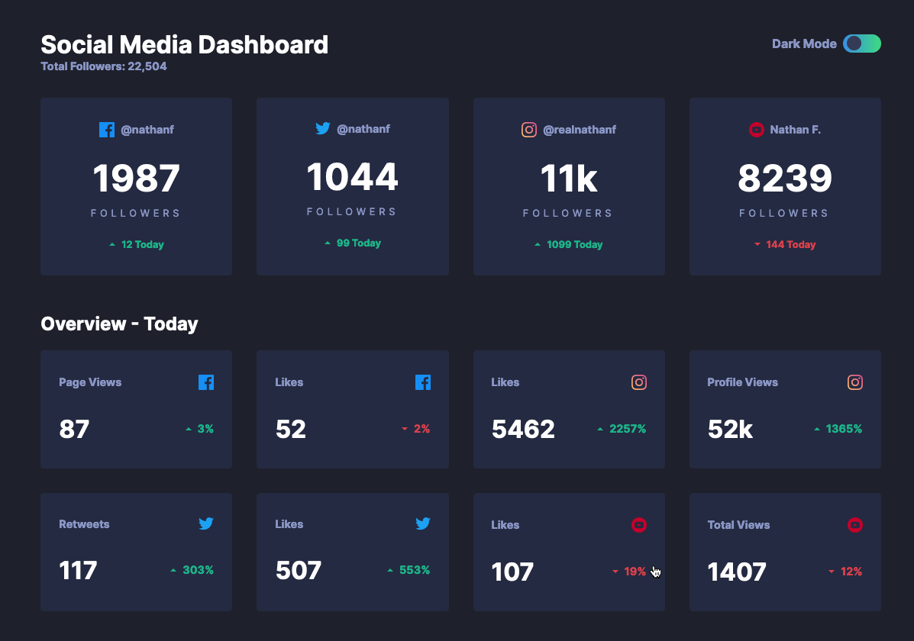

# Frontend Mentor - Social media dashboard with theme switcher solution

This is a solution to the [Social media dashboard with theme switcher challenge on Frontend Mentor](https://www.frontendmentor.io/challenges/social-media-dashboard-with-theme-switcher-6oY8ozp_H). Frontend Mentor challenges help you improve your coding skills by building realistic projects. 

## Table of contents

- [Frontend Mentor - Social media dashboard with theme switcher solution](#frontend-mentor---social-media-dashboard-with-theme-switcher-solution)
  - [Table of contents](#table-of-contents)
  - [Overview](#overview)
    - [The challenge](#the-challenge)
    - [Screenshot](#screenshot)
    - [Links](#links)
  - [My process](#my-process)
    - [Built with](#built-with)
    - [Significant components](#significant-components)
    - [Continued development](#continued-development)
  - [Author](#author)

## Overview

### The challenge

Users should be able to:

&#9745; View the optimal layout for the site depending on their device's screen size

&#9745; See hover states for all interactive elements on the page

&#9745; Toggle color theme to their preference

### Screenshot

### Links

- Live Site URL: [Netlify](https://jakegodsall-social-media-dashboard.netlify.app/)

## My process

### Built with

- Semantic HTML5 markup
- CSS modules
- Flexbox
- CSS Grid
- [React](https://reactjs.org/) - JS library
- [create-react-app](https://create-react-app.dev/) - Build tool

### Significant components

- A corresponding [Figma](https://www.figma.com) design file has been created as practice using the software.
- A global state of theme (dark mode/light mode) is set and passed to all necessary components using the `Context API`.
- Data is stored in a JavaScript object in a realistic structure, and then passed to each component as required (taking the principle of least privilege into account).

### Continued development

- The final step is to save the users default theme using the `Local Storage API` and the `useEffect` hook in React.

## Author

-   Website - [Jake Godsall](https://jakegodsall.com)
-   Frontend Mentor - [@jakegodsall](https://www.frontendmentor.io/profile/jakegodsall)
-   LinkedIn - [@godsalljake](https://www.linkedin.com/in/godsalljake/)
